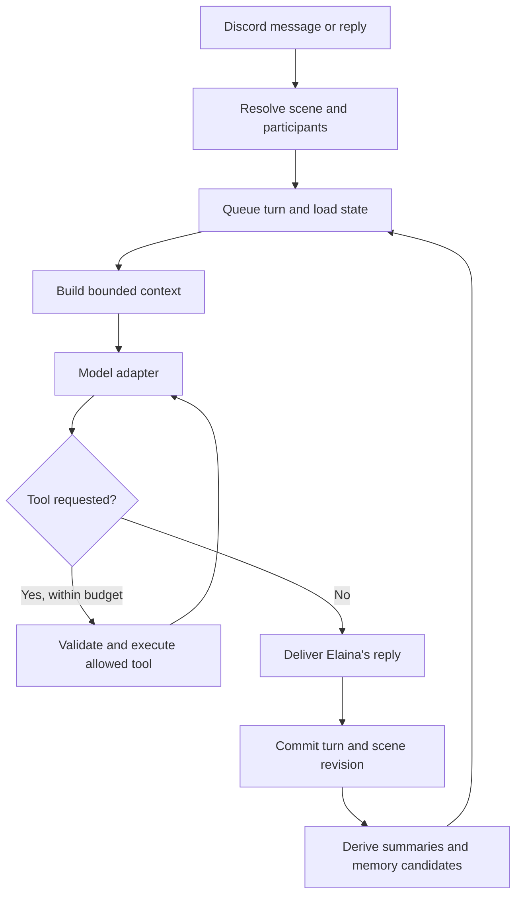

# Elaina: conversation exploration and proposed direction

Explored 2026-09-09. Intended experience: **a roleplay character with persistent scenes and relationships**, as selected by the owner. This is a design proposal, not implemented behavior.

Update: the owner requested one complete integrated overhaul, with local-model exploration and no Gemini usage. The authoritative implementation specification is now `docs/chat-overhaul/IMPLEMENTATION_PLAN.md`; its delivery scope and decisions supersede the staged rollout below. Local probe findings and a copyable implementation-agent handoff are in the same directory.

Elaina should remember where a scene left off, distinguish its participants, develop relationships through shared events, and continue unfinished story threads. Search and actions should support that experience without interrupting ordinary dialogue.

## What exists

| Area | Current implementation | Implication |
| --- | --- | --- |
| Discord entry | `Bot.js:84`: guild messages, explicit mentions, optional channel collection | DMs are excluded. Replies with a message reference do not trigger generation, even when they mention Elaina. |
| Conversation | `event/on_message.js:128`, `utils/text_gen_store.js:2` | One process-local Map stores user or channel message arrays. No durable chat memory. |
| Routing | `utils/operating_mode_selector.js:10` | Auto selects online, then online_lite, then standard based on locally tracked quotas. It does not select by task/tool capability or retry a failed request on another provider. |
| Local model | `utils/lmstudio_request.js:111` | OpenAI-compatible chat completions through the orchestrator, using the Unsloth service. The filename retains the old LM Studio name. |
| Gemini | `utils/gemini_request.js:76` | Persona and serialized transcript are sent together as a content part. Google Search is already declared on both generation paths. |
| Persona | `utils/chat_options.js:293`, `:365` | Active local and Gemini personas are short, substantially matching static character descriptions. There is no scene, relationship, or character-development state. |
| Persistence | `database/database_connection.js` | MongoDB infrastructure already exists for other features. It can host initial conversation/state collections; deployment and index capabilities need verification. |
| Actions | `commands/wd_create.js`, other `wd_*` commands, `integration/` | Image/video generation and domain integrations already exist. Many action handlers are coupled to Discord interactions. |

Configured model identifiers and quotas are repository settings, not evidence of live endpoint availability. The GPU orchestrator already owns local workload admission; conversation work should preserve that contract.

## Issues that currently break continuity

1. **Reply handling and identity.** `Bot.js:89` sends all referenced messages into passive collection. Captured bot messages use `assistant`, while generation history uses `bot`; `openAIMessages` recognizes only `bot` as an assistant. Speaker roles otherwise contain mutable usernames, with no retained stable author ID, timestamp, message ID, or reply relationship.
2. **Conversation scope and reset.** Default history is keyed only by author ID, allowing the same user's history to carry across guilds/channels. In channel mode, the user's entry can share the channel's mutable array. “Forget Everything” deletes only the user's Map entry (`event/on_message.js:348`), leaving channel history. The separate channel-reset command deletes the channel entry, but does not clear aliased user references and has no owner check despite its description.
3. **Lossy context.** Trimming deletes oldest messages using a characters/4 estimate without reserving system, output, image, or future tool overhead. Moving from the large configured cloud window to the small local window destructively trims the shared history. Attachments are supplied only for the current request; they have no durable caption/reference in history. Passive channel collection grows until a generation triggers trimming.
4. **Concurrent turns.** No per-conversation queue or revision check protects history. Two requests can mutate one array while generating answers from different snapshots. Regenerate/continue target the current tail rather than a versioned turn or scene branch.
5. **Failed/empty completions can hang.** The response timer returns before checking completion when text is empty (`event/on_message.js:304`). Local network errors may log without completing the callback. The outer catch references undefined `interaction` and `reponse`. Discord edits are not awaited or reliably caught, and there is no output chunking.
6. **Streaming mismatches.** Local generation imports node-fetch but calls `res.body.getReader()`. An offline probe of the installed package confirmed its body is a Node Readable with no getReader method. Gemini's stream parser expects SSE, but its request omits `alt=sse`, which the official REST examples specify. See [node-fetch stream documentation](https://github.com/node-fetch/node-fetch#bodybody) and [Gemini REST generation reference](https://ai.google.dev/api/generate-content#method:-models.streamgeneratecontent).
7. **Provider options drift.** Call sites pass the thinking boolean into Gemini's attachment metadata argument, leaving its actual thinking argument false. Local thinking is logged but not sent in the request. Named local modes currently share the same configured model, and several mode/template settings no longer affect the active chat-completions payload.
8. **Tool scaffolding is incomplete.** The local prompt builder receives the string `web-search`, but normal requests rebuild messages from context and do not send that prompt or any API tool definitions. Responses read text only; there is no tool dispatch/result loop. Gemini enables hosted search, but drops grounding metadata and all content parts after the first. The API supplies grounding metadata separately from answer text: [Gemini response reference](https://ai.google.dev/api/generate-content#v1beta.Candidate).

These are source findings, except the explicitly noted offline stream probe. No live Discord, database, model, or GPU requests were made.

## Proposed conversation design

The last edge represents reuse on a future turn, not autonomous generation. Ordinary dialogue should take one generation call. Memory extraction can run after delivery; tool loops should have explicit time, token, and step limits. A first limit of two tool rounds is a tunable starting assumption.

Use a shared internal message format with role, author ID, display name, Discord message ID, guild/channel/thread IDs, scene ID, timestamps, reply target, and content parts. Keep provider-specific request formats in adapters. Tool call IDs, results, sources, finish reasons, usage, and errors must survive adapter conversion. Local function calling support must be checked against the actual server/model; an OpenAI-compatible endpoint alone does not establish support. Gemini's manual function calling also requires the application to execute calls and return results: [official function calling guide](https://ai.google.dev/gemini-api/docs/function-calling).

Suggested module boundaries are `chat/conversation_service.js`, `chat/context_builder.js`, `chat/providers/`, `chat/memory/`, and `chat/tools/`. The Discord event handler should delegate to the conversation service. This can be introduced alongside the current handler behind a guild/channel flag.

## Memory for persistent roleplay

| Layer | Contents | Update and retrieval behavior |
| --- | --- | --- |
| Character canon | Voice, core traits, boundaries, established lore | Versioned owner-authored source. Shared across providers. Ordinary chat cannot silently rewrite it. |
| Scene state | Location, fictional time, participants, immediate situation, objects, unresolved actions | Small current snapshot loaded every turn, with source turn IDs and revision. |
| Relationship memory | Shared experiences, promises, established forms of address, trust changes, running jokes | Scoped to the relevant character/participant pair and continuity. Each claim has evidence; avoid reducing relationships to one affection score. |
| Episodic memory | Compact accounts of meaningful past scenes | Retrieve when relevant to the current scene, with recency and importance as additional signals. |
| Knowledge library | Curated lore, server-specific reference material, command help | Separate corpus with source/version metadata; retrieval does not turn reference material into events that happened in the story. |

Initial proposed MongoDB collections: `chat_turns`, `rp_scenes`, `rp_relationships`, `rp_memories`, and `knowledge_documents`. Use stable IDs, scope fields, source turn IDs, status, and revision fields. Store raw turns separately from prompt windows so changing providers never destroys history. Only retain raw content under the chosen retention policy.

Start a continuity inside a guild/channel or thread, with an explicit scene ID. Persist relationships within that continuity by default; carrying them to another scene/world must be intentional. Keep real-user preferences separate from fictional character facts, and distinguish in-character dialogue from out-of-character instructions. Elaina should not invent a player's actions or internal feelings to make the plot advance.

Memory writes should be proposed structured changes, validated against the turn and current revision. Record whether a fact is explicit, inferred, uncertain, or superseded. An unanswered suggestion is not an event, and a joke is not automatically biography. If extraction fails, keep the committed turn and retry derivation later. A deletion/reset generation must prevent a queued extraction job from restoring forgotten content.

Regeneration replaces or branches from a particular turn; memories derived from the rejected continuation must be invalidated. A retcon such as “Actually, we're still at the inn” updates the affected facts and derived summaries with provenance. Reset scene, forget a relationship, and delete all retained history are distinct operations with scopes visible to the user.

For initial retrieval, load exact scene/relationship records and bounded recent turns, plus a rolling scene summary. Add semantic retrieval over older episode summaries and lore after a replay set demonstrates missed recall. Place access/scope filters before retrieval results reach a prompt. Embeddings are a search aid; they do not replace explicit current state or provenance. Selection of a vector store/model remains open until database capabilities, corpus size, and local resource costs are known.

## Natural dialogue and tools

Give Elaina a compact voice guide and a few owner-approved examples of banter, conflict, quiet moments, and out-of-character answers. Match scene pacing and the user's message length. Let past promises, unresolved events, and shared jokes guide callbacks; avoid announcing every memory retrieval. Scene developments should follow established events and leave room for player choices.

Persistent fictional state can include an immediate goal or mood when supported by the scene. It should not require random mood changes, automatic intimacy escalation, or fabricated off-screen events. Distinguish fictional elapsed time from the real time since the last Discord message. Begin with mentions and replies; ambient participation is a later, separately configurable feature.

Search should be available when asked for real-world facts or current information. Fictional lore retrieval and public web search should be separate tools. Preserve source links when search is used; do not accidentally write web claims into scene canon. Gemini already provides a hosted search path, while local mode will need an explicit search backend if desired. “Local only” must have a defined meaning for search and memory extraction as well as response generation. See [Google Search grounding documentation](https://ai.google.dev/gemini-api/docs/google-search).

Expose a small registry of named, schema-validated capabilities. Initially use read-only lore/reference lookup and scoped memory retrieval. Treat retrieved text as evidence, not instructions. User/guild identity and authorization come from Discord context, not model arguments. URL fetching, if added, should reject private/local network targets so web tools cannot reach the GPU infrastructure.

For future natural-language image generation, extract shared generation services from the existing commands. Both slash handlers and chat tools should call those services with the same identity, cooldown, permission, generation, and workload checks. Avoid manufacturing fake Discord interaction objects or allowing the model to invoke arbitrary command names. Record job IDs and successful results; never narrate an image as delivered before the job succeeds. Ask for clarification only when action details materially affect the result, and use idempotency keys to prevent duplicate jobs on retries.

## Suggested implementation sequence

| Milestone | User-visible result | Essential verification |
| --- | --- | --- |
| 1. Reliable conversation foundation | Reply directly to Elaina; stable speaker identity; responses finish or fail clearly | Reply routing, role conversion, parallel turns, empty/error/stream endings, Discord length handling |
| 2. Persistent scene continuity | Resume the same scene after restart and provider switches | Durable turn/state reload, context budget, scope separation, reset behavior |
| 3. Relationships and episodes | Remember promises and relevant shared events | Evidence-backed writes, correction, regeneration invalidation, deletion and delayed-job races |
| 4. Lore retrieval and search | Recall older lore and answer real-world questions with sources | Relevant recall versus irrelevant intrusion, source preservation, tool failures and loop limits |
| 5. Natural-language actions | Request an illustration or supported existing action in conversation | Shared permissions/cooldowns, job status, cancellation and duplicate prevention |

The first playable target should be: **Elaina resumes yesterday's scene, remembers one established promise, recognizes each participant, and continues it consistently after a restart.** Deliver milestones 1 and 2 with a minimal explicit promise record before broad automated memory extraction.

Build a small replay set of owner-approved conversations. Include a return after days away, two players with different relationships, a retcon, a restarted process, a cloud-to-local switch, a failed provider, a request to forget, a current-facts lookup, and casual banter that requires no tool. Measure continuity errors, unsupported memories, voice consistency, latency, and tokens/tool calls per turn. Compare outputs blind where possible; successful retrieval alone does not establish better roleplay.

Open choices for implementation: scene ownership/sharing, how users signal out-of-character messages, which lore is authoritative, retention and forget semantics, desired languages, actual server tool support, and acceptable extra inference latency. These do not block this exploration, but they affect the first persistent-state implementation.

## Exploration scope

Reviewed the message handler, active model adapters, prompt configuration, routing, MongoDB wrapper, representative image command, and orchestrator workload contract. No application code was modified or live services started. Existing working-tree changes were left in place. The repo currently has no test script in `package.json`; the only executed behavioral probe inspected an in-memory node-fetch Response without network access.
